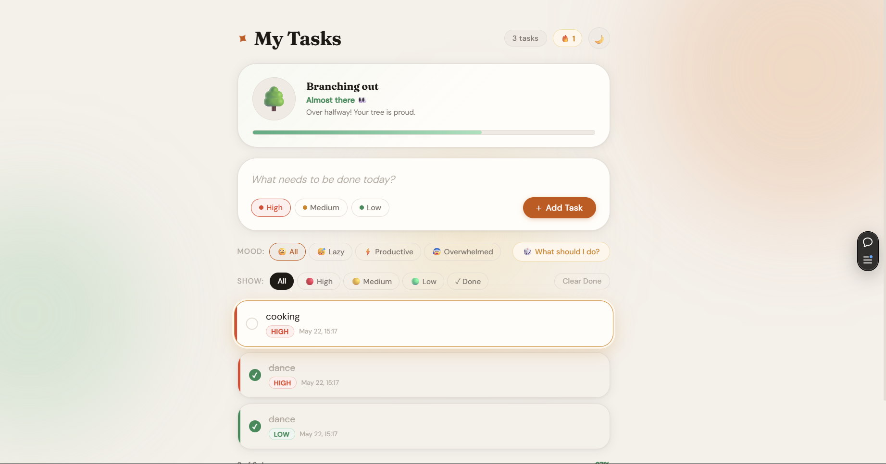

# 🌿 Smart To-Do App

A modern and visually engaging To-Do application with smart productivity features and interactive UI.

## 🚀 Features
- ✅ Add & delete tasks
- 🎯 Priority levels (High, Medium, Low)
- 🎲 Random task picker ("What should I do?")
- 😊 Mood-based filtering (Lazy, Productive, Overwhelmed)
- 🌱 Interactive plant growth system
- 🌙 Dark mode UI
- 🔥 Streak tracking system
- 🎉 Completion feedback animation

## 🖼️ Preview


## 🌐 Live Demo
https://smart-to-do.vercel.app

## 🛠️ Tech Stack
- HTML
- CSS
- JavaScript

## 📌 How to Run Locally
```bash
git clone https://github.com/techy-nerd/smart-to-do.git
cd smart-to-do
open index.html
